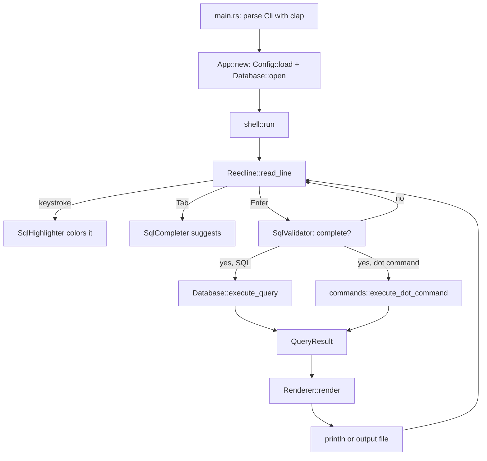
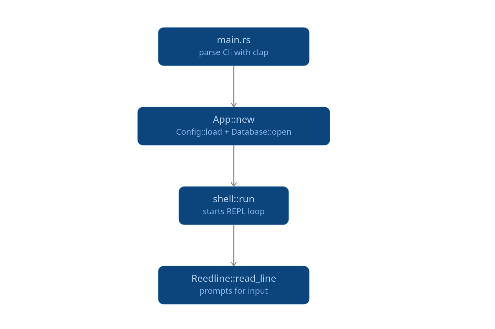
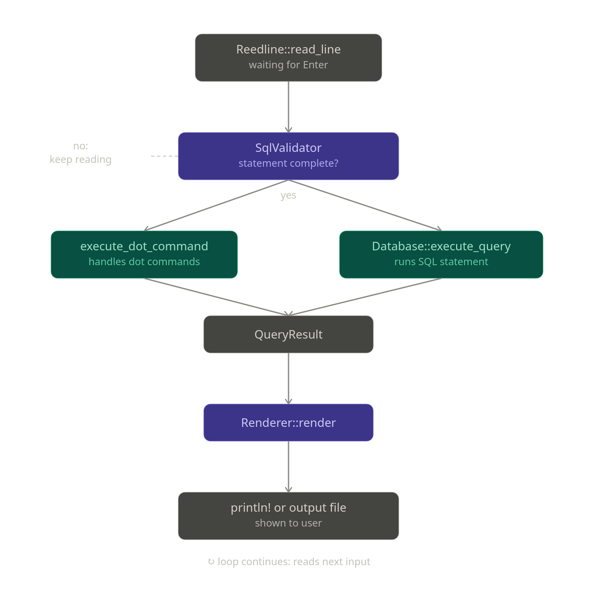

[Contents](00-index.md) | Next: [The Skeleton](02-the-skeleton.md)

# Chapter 0: Architecture

Before writing a line of code, it's worth looking at the house before we
build it room by room. SQLiteForge's finished `src/` tree looks like this:

```
src/
├── main.rs           entry point, CLI parsing, non-interactive mode
├── app/mod.rs         App struct: owns Config + Database, starts the shell
├── database/mod.rs    Database: wraps a rusqlite Connection
├── config/mod.rs       Config: TOML file, ~/.config/sqliteforge/config.toml
├── renderer/mod.rs     Renderer: QueryResult -> box/table/csv/json/... string
├── commands/mod.rs     dot commands: .tables, .schema, .mode, ...
├── history/mod.rs      SQLite-backed query log
├── explorer/mod.rs     ASCII-art database explorer panel (Ctrl+E)
├── completion/mod.rs   SQL autocompletion engine
└── shell/
    ├── mod.rs           the interactive REPL loop (reedline integration)
    ├── highlighter.rs   SQL syntax highlighter
    ├── validator.rs     multi-line "is this statement finished?" check
    └── prompt.rs        the `mydb>` prompt
```

Nine modules, about 3,500 lines total. None of them are large in isolation
(the biggest, `completion/mod.rs`, is under 1,000 lines); the complexity is
in how many small, independent pieces plug into one central loop.

## The data flow

Almost everything in this program funnels through one struct,
`database::QueryResult`, and one loop, `shell::run`. Here's the shape of a
single keystroke-to-screen round trip in interactive mode:


## The main loop

## The repl loop


Everything left of `QueryResult` is about *getting a statement typed in
correctly* (highlighting, completion, validation, history). Everything right
of it is about *doing something useful with the result* (rendering,
redirecting to a file, feeding the database explorer). The database itself
sits in the middle and doesn't know about any of it — `Database` has no idea
reedline, dot commands, or a terminal exist. That separation is what lets us
build and test the database and renderer chapters below without a terminal
at all, before touching reedline in Chapter 5.

## Why these libraries

| Concern | Crate | Why this one, and not the obvious alternative |
|---|---|---|
| SQLite access | [`rusqlite`](https://docs.rs/rusqlite) with `bundled` | `bundled` compiles SQLite's C source directly into the binary, so there's no dependency on a system `libsqlite3` and no version skew between machines. The cost is a slower first build (you're compiling C, not just Rust). |
| Line editing | [`reedline`](https://docs.rs/reedline) | It's the line editor behind `nushell`, and unlike `rustyline`, it exposes `Highlighter`, `Completer`, and `Validator` as traits you implement — which is exactly the shape SQLiteForge needs (color, Tab-completion, multi-line submit-on-semicolon) without forking the editor itself. |
| Config format | `serde` + `toml` | TOML with `#[serde(default = ...)]` on every field means an empty or partially-filled config file is never an error — missing keys just fall back to sane defaults. We lean on this constantly. |
| CLI parsing | `clap` (derive) | A `#[derive(Parser)]` struct is the whole CLI surface; no separate argument-definition code to keep in sync. |
| Output width math | `unicode-width` | Column alignment in the `box`/`table`/`column` renderers needs *display* width, not byte or `char` count — a wide CJK character or an emoji is visually 2 columns wide even though it's 1 `char`. `str::len()` or `.chars().count()` would misalign every box-drawing table the moment non-ASCII data showed up. |

Two dependencies in the real `Cargo.toml` are worth calling out honestly,
because a tutorial that just lists "the dependencies" without checking them
would be lying by omission: **`crossterm`, `ratatui`, `chrono`, and `regex`
are declared, but never imported anywhere in `src/`.** `crossterm` is pulled
in transitively by `reedline` anyway (reedline uses it for raw-mode terminal
I/O), so it's not wasted, just redundant as a *direct* dependency. `ratatui`
— a proper terminal-UI framework — appears to have been added for the
"database explorer panel," but the explorer that actually shipped (Chapter 13)
is just a `String` built out of box-drawing characters and printed with
`println!`. `chrono` and `regex` look like scaffolding for features (timestamp
formatting, pattern-based search) that never materialized. We'll build
without any of them, because none of them are load-bearing, and it's a good
demonstration that "declared in `Cargo.toml`" and "actually used" are
different claims.

## Two persistence stores, doing different jobs

SQLiteForge writes to disk in three places, and it's easy to conflate them:

- `~/.config/sqliteforge/config.toml` — user settings (`Config`).
- `~/.local/share/sqliteforge/history.db` — a SQLite table of every query
  ever run, written by `history::History`.
- `~/.local/share/sqliteforge/history.txt` — a completely separate,
  reedline-managed plain-text history file, written by `FileBackedHistory`.

The second and third stores look redundant, and functionally, mostly are:
Up/Down-arrow recall and Ctrl+R reverse search are powered entirely by
reedline's own `.txt` file. The SQLite-backed `History` struct logs
everything to `history.db` in parallel, but as we'll confirm with a real
`cargo build` in Chapter 8, its own `search`/`recent`/`all_entries` methods
are never called by anything — the compiler flags them as dead code. It
reads like the beginning of a `.history` command that never got wired up.
We'll build it anyway (it's cheap, and it's what's really there), but we
won't pretend it's load-bearing.

## What we won't build

SQLiteForge's own [`docs/REQUIREMENTS.md`](../docs/REQUIREMENTS.md) is
explicit about scope, and it's worth quoting because it explains a lot of
design choices we'll hit along the way (a single connection, no query tabs,
no plugin system):

> Primary focus: Fast startup, keyboard-first workflow, SQLite compatibility,
> intelligent autocompletion, rich output formatting, persistent history,
> terminal-native experience.
>
> Excluded from v1.0: Multiple database connections, query tabs, plugin
> system, AI features, PostgreSQL/MySQL support, query execution plans,
> import wizard, spreadsheet-style editing, visual schema diagrams, vim mode.

With the map in hand, let's start building. First stop: a program that does
nothing but parse its own command line.

Next: [Chapter 1 — The Skeleton](02-the-skeleton.md)
